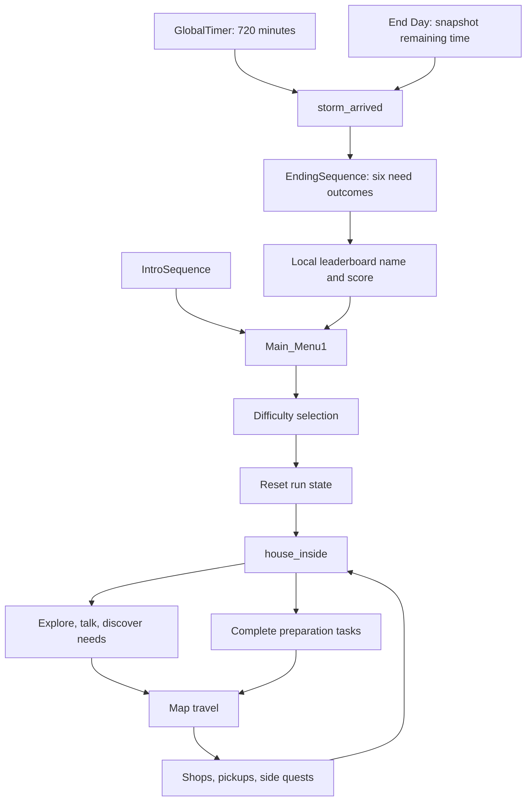

# Architecture

Static source audit: 2026-09-16–17. This document describes the checked-in Godot project, not a proposed design. No runtime playthrough was performed for this audit. Paths are repository-relative; `res://` is the repository root in Godot.

Subsequent conservative cleanup on 2026-09-17 added inventory boundary validation, consistent hotbar wrapping, shared private task requirement counting and removal of redundant quest refresh/pass-through code. Ownership, schemas, balance and lifecycle sequences remain unchanged. Follow-up Godot validation is recorded separately in [TESTING.md](TESTING.md).

## Runtime shape and entry flow

`project.godot` declares Godot 4.6 / Forward Plus, a 1920×1080 canvas-items viewport, and the main scene UID resolving to `game/scenes/intro/IntroSequence.tscn`. The project uses GDScript, scene composition, custom Resource classes and autoload singletons. There is no separate application server or gameplay database in this architecture.

The intro presents studio/Godot/warning/dedication beats, then skippable narrative beats. `main_menu_1.gd::_on_difficulty_confirmed()` fades, waits four seconds, resets run systems, sets difficulty, loads `home`, and calls `GlobalTimer.start_fresh()`. The active run begins at home with the clock running. It does not wait for an Act 1 departure event.

`GameState` retains an Act enum, an Act1State enum and older outcome flags. Some presentation hooks still reference acts, but these declarations do not constitute an implemented four-act progression pipeline. Current preparation completion is recorded in `NeedsLog`; the ending uses its six needs.

## Autoload ownership

These are the 19 registered autoload names, in `project.godot` order. Their scripts are under `game/autoload/`; AudioManager is registered through `game/utils/AudioManager.tscn`, which owns its dedicated audio players. Early managers guard or defer accesses where later autoloads are not ready; preserve initialization order when changing dependencies.

| Autoload | Responsibility and owned state |
| --- | --- |
| `CursorState` | Owns global mouse mode; UI requests release when the owner exits. |
| `VisualSettings` | Quality preset, VHS toggle and UI scale; persists settings and applies scene-node quality changes. |
| `LocalizationManager` | English/Tagalog choice, CSV text lookup and automatic control localization. |
| `TransitionOverlay` | Global black fade CanvasLayer; manages overlay alpha and mouse interception. |
| `GlobalTimer` | Elapsed minutes, tick accumulator, pause counter, threshold firing and storm signal. |
| `SceneManager` | Scene path registry, current location, travel lock, spawn request and additional zone arrays. |
| `NeedsLog` | Discovered/resolved need sets and individually boarded window IDs. |
| `GameState` | Cash, difficulty, guide/quest flags, collected world IDs, historical act/outcome state. |
| `DevMode` | Session unlock, guarded commands, clock pause and per-run ranking state. |
| `TravelCalculator` | Five-location weighted graph, shortest paths and randomized travel costs. |
| `InventoryManager` | Seven item slots, quantities, combine recipes and one recoverable discard stack. |
| `SideQuestLog` | Mang Nestor chicken quest state and objective events. |
| `EconomyManager` | Purchase/barter validation and historical barter availability state. |
| `ShopUi` | Global shop CanvasLayer and duplicated, per-resource-path stock cache. |
| `StormEnroachment` | Open/danger/inaccessible location states and danger-entry penalty. Spelling matches registration. |
| `AudioManager` | Dedicated music/ambience/SFX/voice players, transient SFX, and audio bus settings. |
| `StormAudioController` | Persistent weather audio layers reacting to time, location and storm state. |
| `LeaderboardManager` | Local ranked run records and early-ending remaining-time snapshot. |
| `VhsCrtOverlay` | Global VHS/CRT shader overlay driven by visual settings. |

`TaskObject.gd` and `HUDOverlay.gd` live in the autoload directory but are **not** registered singletons. TaskObject is a reusable `class_name` base. HUDOverlay is instantiated by the player scene. Folder placement and old header comments are not authoritative registration evidence.

## Clock, travel and transitions

`GlobalTimer` starts at minute 0, displayed as 6:00 AM, and caps at 720 minutes, 6:00 PM. Passive time advances in `_process`; task/travel burst costs call `add_time()` even while paused. Burst progression emits updates and threshold checks for every crossed minute. Signals are `time_updated(current_minute)`, `encroachment_threshold_reached(zone_id)` and `storm_arrived`.

| Difficulty | Real seconds / game minute | Nanay cash | Score multiplier |
| --- | ---: | ---: | ---: |
| Story | 2.0 | 800 | 0.85 |
| Standard | 1.5 | 700 | 1.00 |
| Challenge | 0.8 | 600 | 1.25 |

`pause_timer(self)` acquires one idempotent pause per Node. `resume_timer(self)` releases only that owner's pause; `tree_exiting` releases it automatically. Reset disconnects and clears ownership before old scenes leave, preventing a stale release from unpausing a new run. Anonymous calls retain the legacy counter API. At zero, the timer resumes only before the deadline. Map/backpack and fades still do not pause the clock. PauseMenu uses separate SceneTree pause. Dev Mode has its own timer pause owner; clock rewind preserves other owners and preparation progress while resetting storm thresholds and closures.

| Elapsed minutes | Implemented storm change |
| ---: | --- |
| 240 | Grocery becomes dangerous. |
| 360 | Grocery becomes inaccessible. Historical barangay danger entry is ignored by StormEnroachment's five-location state table. |
| 540 | Hardware and pharmacy become dangerous. |
| 720 | Clock stops, storm signal starts ending transition. |

`TravelCalculator` computes a shortest route over home, ate_linda, hardware, pharmacy and grocery. Each route edge receives ±2 minutes of variance. The graph is directional as written; for example pharmacy has a home edge, while home has no pharmacy edge. Intermediate graph nodes calculate cost; they are not visited as playable scenes along the way.

`MapScreen` samples and caches a displayed travel cost, then passes it to `SceneManager.travel_to()` so confirmation uses the sample shown. Dangerous destinations additionally cost 15 minutes; the map labels danger but its numerical travel estimate excludes that penalty.

SceneManager validates availability/path/closed state and acquires the travel lock before applying danger penalties. It then fades out, charges travel time, replaces the scene, fades in and emits `travel_completed`. Generation checks after waits and time charges prevent a superseded operation from changing scenes or reporting arrival. It aliases `bodega` and `act1` to home for travel accounting. Spawn markers consume pending IDs; home defaults to `main_door`. Guarded Dev Mode teleport reuses the transition, skips time and danger charges, and permits closed locations on its six-location whitelist.

Storm arrival takes priority immediately: it invalidates previous transitions, clears travel/spawn state, closes the global shop, unpauses the scene tree and fades to EndingSequence. The ending owns its fade-in. `SceneManager.reset()` invalidates pending work. `TransitionOverlay` replaces its previous tween and lets canceled callers resume rather than waiting forever on a killed tween's `finished` signal. Task and smoke-break continuations check the same generation. Tasks consume supplies and commit their results after completion sounds but before charging time; a deadline triggered by the charge therefore sees the completed result. An interrupted, uncommitted task retains its supplies. No transition queue or new manager was added.

## World and player composition

Playable location scenes under `game/scenes/locations/` combine imported environment models, collisions, PlayerV2, interactables, NPCs, markers, camera volumes and weather/audio nodes. Active map travel routes use `house_inside.tscn`, `tindahan.tscn`, `hardware.tscn`, `pharmacy.tscn` and `grocery.tscn`; bodega is an interior destination. Additional act, test, barangay and Mang Romy scenes remain in the repository or registry without being part of the five-node travel graph.

`game/entities/playerv2/playerv_2.gd` is the current CharacterBody3D controller. It implements WASD motion, Shift sprint, gravity, acceleration, visual facing and idle/walk/run animation. Walk/sprint speeds are 3/5. Step-up collision probes negotiate small obstacles. A once-per-run stand-up animation leads to the optional tutorial. A jump constant remains, but this controller does not implement a jump input handler.

`Camera2D5Controller` follows the player with smoothing and look-ahead, optional landing shake, and quality-controlled depth of field. `CameraVolume` Area3D signals change camera height/distance, X bounds, optional Y lock and Z-wall compression through tweens. A single current volume is tracked; overlapping volumes are not managed as a priority stack.

The older `game/entities/player/player.gd` implements first-person mouse look, jump, raycast interaction, head bob, speed-dependent FOV and flashlight. It is a separate controller, not the behavior of PlayerV2. It lacks PlayerV2's Area3D interaction callbacks.

## Interaction and dialogue contracts

`Interactable` (`game/objects/interactables/interactable.gd`) extends Area3D and exposes `interact()`, `is_interaction_available()`, a prompt label and showing state. Body entry/exit connects player callbacks and emits `player_entered`/`player_exited`; `prompt_visibility_changed` controls prompts during dialogue.

PlayerV2 tracks nearby interactables. A single available interactable is selected directly; multiple candidates are filtered toward the player's horizontal facing and ranked by distance. E interacts; Space advances a showing interaction. Selection is recomputed on dirty events such as area/facing/lock changes, not continuously for every position change. Movement locking and initial animation input locking are separate booleans. Shop openness is an explicit interaction guard; there is no unified modal owner for every interface.

The main inheritance families are:

- `Interactable → NPC → StoryNPC / QuestNPC / TradeShopNPC / ShopPeople` and named character subclasses.
- `Interactable → TaskObject → RoofTask / WindowTask / FridgeTask / MedicineTask / water / radio`.
- `Interactable → NarrativeObject / InnerMonologue / WorldItem / Door` and the main-door map opener.

NPCs own instantiated DialogueUI children under their CanvasLayer. DialogueSequence resources contain DialogueLine resources, with speaker, text and optional expression portrait. Base NPC owns sequence position, typewriter tween, voice lifecycle and its clock pause. Subclasses choose sequences or act on completed dialogue. QuestNPC adds an accept/decline modal and hooks. NarrativeObject and InnerMonologue own similar MonologueUI flows; NarrativeObject can discover a configured need on interaction.

## Preparation state and task execution

`NeedsLog` owns ROOF, MEDICINE, FOOD, WINDOWS, WATER and FLASHLIGHT. Discovery and resolution are idempotent and emit `need_discovered`/`need_resolved`; resolution auto-discovers. Discovering all six completes the house-exploration guide flag. Window progress emits `window_boarded` and resolves WINDOWS after two unique IDs.

Completing Nanay1's initial dialogue grants difficulty-dependent money once and unlocks house tasks/cues. Lola's first completed dialogue marks the guide and discovers MEDICINE. Her local `_has_met` flag is recreated on scene reload, while the global guide flag persists. Most task interaction is gated by `house_tasks_unlocked`; map travel is not a full enforced Act1 state-machine transition.

TaskObject checks required item quantities, presents missing/ready/completed dialogue, then fades, consumes eligible items, plays completion SFX, adds its burst time, resolves the need and updates visual cues. BRING_HOME, USE_IN_PLACE and COMBINE item types are consumed; TOOL and TRADE types remain. Completion state is reconstructed from NeedsLog when a scene is recreated. WindowTask uses per-window IDs rather than only the aggregate need.

| Task | Required items | Burst cost |
| --- | --- | ---: |
| Roof | tarp, nails, hammer | 15 min |
| Food/fridge | four canned_goods | 5 min |
| Medicine | medicine | 3 min |
| Water | wrench, water_jug | 10 min |
| Radio/flashlight preparation | working_radio, working_flashlight | 5 min |
| Each window | plywood, nails, hammer | 12 min |

The house window IDs are `bedroom_window` and `living_room_window`. Hammer is TOOL and retained. Wrench has the default BRING_HOME resource type and is consumed by the water task. FLASHLIGHT is the aggregate radio-and-flashlight preparation objective, not just a battery pickup.

## Inventory, economy and resource model

`ItemData` (`game/resources/items/ItemData.gd`) defines ID, localized name/description/pickup lines, icon, model PackedScene, price, barter flag and type. IDs are string contracts across inventory, recipes, task requirements and quests. ItemData.use() is empty; the generic inventory use method still removes an item after calling it.

InventoryManager owns seven slots in parallel `inventory` and `item_quantities` arrays. Canned goods and nails stack; other items occupy individual slots. The stack dictionary contains 99 values but add_item does not enforce those limits. The hotbar represents the full inventory, not a separate allocation. Hotbar selection and wheel wrapping use the same capacity; key 8 remains an explicit alias for the seventh slot.

Recipes are `batteries + dead_flashlight → working_flashlight` and `batteries + broken_radio → working_radio`. The backpack UI checks combinations and loads result data; InventoryManager removes both source slots and emits inventory and combination signals. The manager rejects null additions and validates distinct in-range non-null source slots, a known recipe and its matching result ID before combining. Invalid requests leave state and signals unchanged; successful combinations preserve the existing three inventory notifications followed by item_combined. The discard slot holds one recoverable stack; replacing it permanently discards the previous stack.

WorldItem optionally displays pickup dialogue/confirmation, adds its ItemData and queues itself for deletion. A nonempty `world_item_id` is remembered in GameState so revisiting the scene does not respawn it. This persistence lasts for the current run only.

ShopData owns a shop label/subtitle and ShopItem resources. ShopItem pairs ItemData with a shop-specific price and stock (`-1` unlimited). ShopUi duplicates each loaded catalogue deeply and caches by resource path. This gives session stock persistence without editing source resources. Normal and discounted catalogues have different paths and separate cached stock.

ShopUi temporarily substitutes the shop price on ItemData, invokes EconomyManager.purchase, restores the original price and consumes stock on success. EconomyManager validates purchase data/price, spends cash, refunds on inventory rejection and emits purchase success/failure. Inventory/cash signals refresh dependent interfaces. Barter state and a barter API remain in EconomyManager, but current named side-quest trades use their own code paths.

The pharmacy `Lottohan` Interactable owns a `ScratchLottoUI` child. Six independently drawn fruit form two rows; each three-fruit row pays once. Scratch All, close, storm interruption and scene exit settle a paid ticket once. The screen keeps the clock running and prevents map, backpack and other interactions while open.

## Side quests and shop NPCs

`SideQuestLog` stores the Mang Nestor quest as not_started, active, ready_to_turn_in or completed. It is the inventory-change subscriber for quest readiness (Mang Nestor does not duplicate that subscription) and updates readiness when half_chicken appears/disappears, emitting objective signals consumed by checklist UI.

- Mang Nestor acceptance gives 150 cash once. Go To Chooks sells half chicken for 145. Return consumes chicken, adds tarp, grants another 5 and completes the quest. A full backpack can turn in the non-stacking chicken because it frees the tarp's slot. Completed quests reject repeated turn-ins. Current behavior leaves 10 cash above the player's pre-quest balance.
- AteLindaQuestShop consumes a hammer to unlock a discounted catalogue; it uses GameState's discount flag rather than EconomyManager.barter.
- MoneyBeggar optionally spends 20 cash and records a donation flag.
- SmokeBreakNPC optionally adds 20 minutes with a fade and records a one-time flag.
- Grocery, pharmacy, hardware and Chooks vendor scripts inherit ShopPeople, opening configured shop resources after dialogue completion. TradeShopNPC is a separate related base used for Ate Linda's custom behavior.

Nanay1 later selects dialogue at four/eight elapsed hours. Its exported `cash_to_grant` is superseded by difficulty cash. The older Nanay class branches on roof discovery. StoryNPC provides prompt customization over standard NPC dialogue.

## UI ownership and presentation

PlayerV2's scene instantiates BackpackUI, HotbarUI, HUDOverlay, PreparationChecklistHUD, MapScreen and PauseMenu. Replacing a location scene recreates these interfaces; their content is rebuilt from singleton state. Groups including `player`, `hotbar_ui`, `backpack_ui`, `map_screen` and `preparation_checklist_hud` provide cross-scene discovery and broadcast calls. UI ownership is distributed across player children, interactable children and global overlays.

HUDOverlay reads clock/ETA; preparation/checklist interfaces combine need state, guide flags and side objectives. Map node/road/storm drawing scripts present location states and confirmations. Backpack uses drag/drop slots for inventory and combination/discard operations. PauseMenu closes map/backpack and pauses the SceneTree. Its idle navigation is centered; opening Settings or Dev Mode places the tabs 12 logical pixels across the centered card's left border. `CursorState` coordinates mouse visibility across gameplay and UI owners. TutorialModal has a session-only static hide preference. `GameUIStyle.gd` and `game/ui/GameTheme.tres` centralize much of the visual styling, while several modals are built programmatically.

TransitionOverlay is layer 10; ShopUi is layer 8; VhsCrtOverlay is layer 90. The VHS shader effect is separate from menu/HUD vignette overlays. Thus toggling VHS is not equivalent to disabling every screen-darkening effect.

LocalizationManager loads `game/localization/game_text.csv` and supports exact-source and key-based lookup, formatted translations and automatic tree localization on node addition/language changes. It tracks its last rendered value so a later dynamic assignment is not overwritten by an old source string. Quest choices retain source/format values and refresh on language changes. Five choice prompts have English/Tagalog rows; action-button translations remain as authored. Backpack/hotbar names wrap inside slots. Intro narrative coverage remains incomplete; this is not a full translation rewrite.

Dev Mode is unlocked by typing `HELLOWORLD` at the idle main menu in editor runs or tagged internal debug exports. It is never persisted, and each command checks build and session authorization. Enabling it makes the current run unranked, even after disabling it; the ending skips name entry and `LeaderboardManager.record_run()` rejects the score. The next run resets ranking state.

## Audio and weather

AudioManager's autoload scene contains MusicPlayer, AmbiencePlayer, SFXPlayer and VoicePlayer. It supports music/ambience fades, voice looping/stopping, bus volume settings and transient overlapping SFX. `game/audio/Sfx.gd` is a shared helper used throughout interactions and UI. Fixed-player stop methods do not cover every transient SFX node.

StormAudioController owns rain, wind, heavy-storm, rumble and grocery-announcement players. It listens to timer updates/thresholds/storm, location-state changes and travel completion, and also schedules random thunder/wind one-shots. Scene/location guards govern when the weather layers play.

`game/weather/StormRainController.gd` extends GPUParticles3D. It combines normalized clock progress, exported bias and current-location danger state to change visibility, emission, amount, lifetime and speed. Weather visuals/audio are driven by shared clock/state, not a separate meteorological simulation. EndingSequence also owns cinematic storm/lightning behavior.

## Ending and persistent storage

EndingSequence presents six camera/outcome beats for the six NeedsLog entries, with completion-dependent visual cues. Result tiers depend on completed-need counts: all six, at least four, at least two, fewer than two. `end_day.gd` snapshots remaining minutes before forcing storm arrival; natural deadline endings have no remaining-time bonus.

The ending asks for a nonempty player name (UI maximum 24 characters), records the score, resets run systems and returns to the menu. Score is `(tasks_completed × 1000 + remaining_minutes) × difficulty_multiplier`; sorting uses score, then remaining time, then timestamp. LeaderboardManager retains up to 25 entries when recording; load sanitizes/sorts existing data without the same trimming step. This is a local leaderboard, not a network service.

| File under Godot `user://` | Contents |
| --- | --- |
| `leaderboard_scores.json` | Local run records with name, completed count, remaining minutes, difficulty, score and timestamp. |
| `audio_settings.cfg` | Saved bus volumes. |
| `visual_settings.cfg` | Quality, VHS enablement and UI scale; defaults High/on/140%, scale range 100–175%. |
| `language_settings.cfg` | English/Tagalog selection. |

The managers load these files during `_ready()`. Settings use ConfigFile sections: audio `[buses]` maps the Master/Music/Ambience/SFX/Voice names to dB values; visual settings use `[quality] preset`, `[effects] vhs_crt_enabled`, and `[ui] scale_percent`; language uses `[language] current`. Missing settings retain defaults. Visual settings normalize/clamp supported values.

Leaderboard storage is a JSON array of dictionaries with `player_name`, `tasks_completed`, `remaining_minutes`, `difficulty`, `score`, and `recorded_at`. Loading checks the top-level array and dictionary entries, supplies missing-key defaults, clamps remaining minutes, and recalculates scores from current difficulty multipliers. Unreadable/invalid files warn and yield an empty list. There is no explicit schema version or migration system in these persistence implementations. The location is Godot's project-specific `user://`, not a repository save directory.

These files persist preferences and completed scores. They are **not a gameplay save/resume system**. Current inventory, scene position, elapsed time and quest progress live in memory. New-run reset in the menu and post-ending reset remain separate code paths. Both now reset ShopUi's stock cache; future state additions must still account for all reset paths.

## Boundaries and verified maintenance concerns

### State, dependency direction and contracts

Global session state belongs to autoloads; local state includes player locks/target selection, NPC dialogue indices, task completion guards and UI selection. Disk-persistent state is limited to preferences and scores. Tutorial suppression is process-static; world pickups and task/quest completion survive scene changes through run-state managers, not disk saves.

The dominant dependency direction is scene-owned controllers/interactables/UI → manager command/query APIs → change signals → UI and other observers. This is not a strict layered architecture: managers also call each other (`GameState` configures timer pacing; inventory drives side-quest readiness; SceneManager consults storm/travel/time). There is no central event bus or unified player state-machine framework.

Preserve these contracts: exact registered singleton names; stable resource/item/location/window IDs; player/group discovery before spawn placement; synchronized item and quantity arrays; matching timer pause/resume ownership; reset coverage for run state; and scene-local UI rebuilt from manager state. See [AGENTS.md](../AGENTS.md) for operational rules and [DEVELOPMENT.md](DEVELOPMENT.md) for naming/typing conventions.

### Input, physics and dependencies

`project.godot` defines movement, sprint, E interaction, Space dialogue advance, M map, Tab backpack and hotbar actions 1–8; [README controls](../README.md#controls) separates mapped legacy actions from PlayerV2 behavior. Pause uses built-in `ui_cancel`; PlayerV2 also checks the custom `escape` action for mouse capture. Inventory capacity remains seven.

CharacterBody3D movement uses `move_and_slide()` followed by step-up collision probes. Interactions/camera volumes use Area3D body detection and groups. No named collision-layer scheme is configured. Most scene nodes omit explicit layer/mask overrides; `game/tests/test_world/test_world.tscn` has layer/mask 3. That test override is not a project-wide category assignment.

No runtime addon directory, enabled editor plugin, C# project or external application backend was found. `.agents/skills/` and `skills-lock.json` configure agent guidance rather than game runtime dependencies. Scenes reference both curated and raw assets; Git LFS and Godot imports are required parts of checkout/asset handling.

### Performance-sensitive areas

Player collision probes and camera follow run in physics updates; lighting, voxel/environment resources, GPU rain and full-screen VHS effects affect rendering. Timer bursts emit a signal for each crossed minute. UI slot caches/dirty interaction flags limit repeated work; quality presets alter rendering features. These are inspection-based hotspots, not benchmark results. No measured hardware budget is established, and speculative optimization is not justified by this list.

### Existing debt

- SceneManager and StormEnroachment duplicate zone state. Keep consumers and reset paths consistent if changing closure behavior.
- Milestone 2 covers owned-pause cleanup and deadline/reset cancellation with focused runtime checks. Anonymous legacy timer calls still require explicit pairing; use Node ownership for new scene-owned pauses.
- The unused EconomyManager barter API still checks capacity before removing the outgoing item. Mang Nestor's active quest exchange is corrected.
- Public inventory APIs still expose mutable arrays; direct external array mutation can violate invariants. Add/combine boundary validation does not encapsulate those arrays.
- `ShopItem.reset_stock()` is a stub; active stock reset comes from clearing ShopUi's duplicate cache.
- Milestone 1 removed Tindahan's missing hidden greybox instance; the current GLB and its imported collisions remain. The user chose to retire `test_room2` and its old `Act1.tscn` door rather than redirect it. Current map travel to the shop uses `ate_linda`.
- Historical scene registries, act fields, duplicate monologue implementations and first-person controller coexist with the active flow. Their presence alone does not establish player-facing features.

## Verification scope

Milestone 1 follow-up (2026-09-24): the checklist checks scene-tree membership before deferred resize work; localization holds a weak reference for deferred node localization so freed temporary controls are safely skipped. Neither change alters task state, translations or pause ownership. Warning cleanup preserves intentional integer division and asynchronous task hooks. See [TESTING.md](TESTING.md) for fresh-import, language-server, regression and normal-timing integration evidence and its limits.

The original documentation audit used static inspection. Subsequent Milestone 1/2 engine runs are recorded in [TESTING.md](TESTING.md). Broader manual usability/audio, exhaustive modal combinations, complete translation coverage and distribution testing remain separate verification work.

## Planned architecture and change policy

Historical storm-event/route-risk/request-resource ideas are **NOT IMPLEMENTED**; see [ROADMAP.md](ROADMAP.md) for provenance and uncommitted status. A full gameplay save format is not established.

Significant architecture changes should document current state, define the problem, compare real alternatives, select an approach, record the decision in [DECISIONS.md](DECISIONS.md), and update this document. Do not use this policy to justify unrelated refactoring or introduce duplicate global managers.
